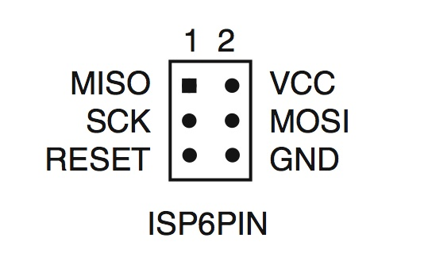

# BME SBT gázkar
A potméter pozíciójának megfelelő kitöltésű PWM jelet generál. A kiadott jel frekvenciája kb. 50Hz, az impulzusok szélessége 1ms és 2ms között változtatható.

## Bekötés
Felirat | Funkció
--------|--------
5V | 5V tápfeszültség
GND | föld
PWM | PWM jel kimenet, 0-5V
PB0 | [későbbi felhasználásra]
PB1 | [későbbi felhasználásra]
PB2 | engedélyezőjel; 0V:tilt, 5V:engedélyezés

## Programozás
Az ISP pineken keresztül programozható, arduinohoz hasonlóan (AVR ISP). A mikrokontroller ATtiny25.

## Debug
DEBUG_SIGNALS macroval fordítva a PB0 és PB1 pineken mérhetők az időzítések